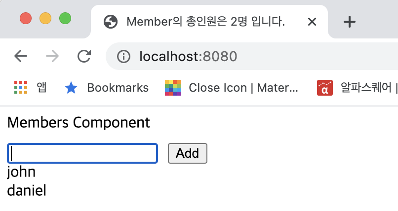

## 케이스 주제

Q. react의 useEffect함수를 이해하기 위해 구현을 해보자.

## 기능 요구사항

1. effect를 실행하는 함수와 의존성 데이터를 저장한다.

2. html element를 렌더링 후에 effect를 실행할 수 있도록 한다.

3. 의존성 데이터를 비교하여 effect 실행여부를 결정한다.

4. effect 함수를 통해 document의 title을 변경한다.

## 기능 작동 이미지

## 실행 방법 / 문제 풀이 방법
1. npm install
Run `npm install`

2. excution
Run `npm run dev`

## 문제
- q1. state 변경 함수(updateState)를 완성하시오.

- q2. useState 함수를 [value, function]을 반환하도록 완성하시오.

- q3. 데이터 변경을 위한 함수를 완성하시오.

## 주요 학습 키워드
- useState 함수의 동작원리를 알아보자
